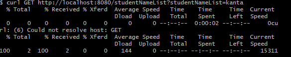
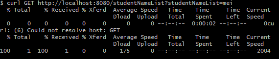

# Webアプリケーション構築

## 課題（Mapの追加）

- 講座内で構築したアプリケーションに、Map（name,age）を取り入れる

## やったこと

1. private Map<String,String>student の定義
2. HashMapを初期化
3. リストの作成（ジブリキャラクター3名）
4. 年齢を取得するためのstudentNameListを定義
5. （Git Hub上）curl GET http://localhost:8080/studentNameList?studentNameList=kantaを実行（結果1）
6. （Git Hub上）curl GET http://localhost:8080/studentNameList?studentNameList=meiを実行（結果2）

## 結果

結果1

結果2
